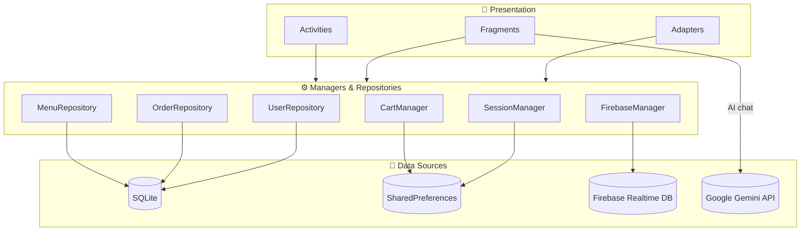

# 🍔 BiteBridge

> **Delicious food. Delivered to you.** — a full-stack food-ordering Android app with a real-time backend, an admin dashboard, and a built-in AI assistant.

<p>
  
  
  
  
  
  
</p>

BiteBridge is a native Android application I built to practice **end-to-end product engineering** — from the mobile UI and local persistence all the way to a cloud backend, live order tracking, and an LLM-powered chat assistant. It covers the full customer journey (browse → cart → checkout → track) as well as the operator side (an admin panel for managing the menu).

---

## 📋 Table of Contents

- [Highlights](#-highlights)
- [Screenshots](#-screenshots)
- [Features](#-features)
- [Tech Stack](#-tech-stack)
- [Architecture](#-architecture)
- [Data Model](#-data-model)
- [Getting Started](#-getting-started)
- [Project Structure](#-project-structure)
- [Skills Demonstrated](#-skills-demonstrated)
- [Roadmap](#-roadmap)
- [License](#-license)

---

## ✨ Highlights

- 📱 **Native Android client** in Java with Material Design, Activities + Fragments, and a bottom-navigation shell.
- ☁️ **Firebase Realtime Database** for live order synchronization between customers and staff.
- 🗄️ **Local-first data layer** — SQLite for catalog/orders and SharedPreferences for session & cart persistence.
- 🤖 **AI food assistant** powered by Google Gemini, aware of the current menu context.
- 🛠️ **Admin dashboard** for full menu CRUD (create, read, update, delete).
- 🔔 **Push notifications, GPS location, and offline-aware UI** built on native platform APIs.

---

## 📸 Screenshots

 
  
  
  

  

---

## 🚀 Features

### Customer experience
- **Authentication** — register / log in with persistent auto-login sessions.
- **Menu browsing** — categorized, seeded catalog with images loaded via Glide.
- **Search** — quickly filter items by name or category.
- **Food details** — per-item view with description, price, and add-to-cart.
- **Persistent cart** — add / remove / adjust quantities; survives app restarts (serialized with Gson).
- **Checkout** — choose **delivery** (with address) or **pickup**, then confirm the order.
- **Order history** — review past orders and their line items.
- **Live order tracking** — order status updates stream in real time from Firebase.
- **AI assistant** — chat with a Gemini-powered helper that can answer questions about the menu.

### Operator / Admin
- **Admin dashboard** — add, edit, and delete menu items, backed by the SQLite catalog.

### Platform integration
- **Push notifications** on order updates (Android 13+ runtime permission handled).
- **Location services** via Google Play Services for delivery.
- **Network awareness** — a broadcast receiver surfaces connectivity changes with in-app snackbars.

---

## 🧰 Tech Stack

| Layer | Technology |
|---|---|
| **Language** | Java 17 |
| **UI** | Android SDK 34, Material Components 1.11, ConstraintLayout, RecyclerView, Fragments |
| **Cloud backend** | Firebase Realtime Database & Firebase Auth (Firebase BoM 32.7) |
| **Local storage** | SQLite (`SQLiteOpenHelper`) + SharedPreferences |
| **Networking** | OkHttp 4.12 |
| **AI** | Google Gemini API (`gemini-2.5-flash`) |
| **Images** | Glide 4.16 |
| **Serialization** | Gson 2.10 |
| **Location** | Play Services Location 21.1 |
| **Build** | Gradle (AGP 8.5) with Version Catalogs |
| **Testing** | JUnit 4, Espresso |

**Minimum requirements:** Android 8.0 (API 26) and above · **Target:** Android 14 (API 34).

---

## 🏗️ Architecture

BiteBridge follows a layered, package-by-feature structure. UI components talk to **repositories** (data access) and **singleton managers** (cross-cutting state), which in turn wrap SQLite, SharedPreferences, and Firebase.



**Design notes**
- **Singletons** (`CartManager`, `SessionManager`, `FirebaseManager`) provide a single source of truth for cart, session, and cloud order state.
- **Repositories** isolate SQL from the UI, keeping activities/fragments thin.
- **Real-time sync** uses Firebase `ValueEventListener` / `ChildEventListener` so status changes propagate without manual refresh.

---

## 🗃️ Data Model

Local SQLite schema (`bitebridge.db`):

| Table | Purpose | Key columns |
|---|---|---|
| `users` | Registered accounts | `user_id`, `name`, `email`, `phone`, `is_admin` |
| `menu_items` | Food catalog | `item_id`, `name`, `category`, `price`, `image_url`, `is_available` |
| `orders` | Order headers | `order_id`, `user_id`, `total`, `type`, `address`, `status`, `timestamp` |
| `order_items` | Order line items | `line_id`, `order_id`, `item_id`, `quantity`, `unit_price` |

Orders are also mirrored to Firebase under `bitebridge/orders` for real-time status tracking.

---

## ⚡ Getting Started

### Prerequisites
- [Android Studio](https://developer.android.com/studio) (Ladybug or newer)
- JDK 17
- A Firebase project
- A Google Gemini API key ([Google AI Studio](https://aistudio.google.com/app/apikey))

### 1. Clone the repository
```bash
git clone https://github.com/<your-username>/BiteBridge.git
cd BiteBridge
```

### 2. Connect Firebase
1. Create a project in the [Firebase Console](https://console.firebase.google.com/).
2. Add an Android app with the package name `com.malak.bitebridge`.
3. Download the generated **`google-services.json`** and place it in the **`app/`** directory.
4. Enable **Realtime Database** and **Authentication** for the project.

### 3. Add your Gemini API key
Store secrets outside version control. Add the key to your **`local.properties`** (already git-ignored):
```properties
GEMINI_API_KEY=your_api_key_here
```
Then expose it to the app via `BuildConfig` in `app/build.gradle`:
```gradle
android {
    defaultConfig {
        buildConfigField "String", "GEMINI_API_KEY",
            "\"${project.findProperty('GEMINI_API_KEY') ?: ''}\""
    }
    buildFeatures { buildConfig true }
}
```
…and read it in code with `BuildConfig.GEMINI_API_KEY` instead of hard-coding it.

### 4. Build & run
```bash
./gradlew installDebug
```
Or press **Run ▶** in Android Studio with an emulator or device (API 26+).

---

## 📁 Project Structure

```
app/src/main/java/com/malak/bitebridge/
├── activities/     # Splash, Login, Register, Home, FoodDetail, Cart, OrderConfirm, Admin
├── fragments/      # Menu, Search, OrderHistory, Profile, Chat (AI)
├── adapters/       # RecyclerView adapters (Menu, Cart, Chat, OrderHistory)
├── models/         # User, MenuItem, Order, OrderItem, CartItem
├── database/       # DatabaseHelper + Menu/Order/User repositories (SQLite)
├── firebase/       # FirebaseManager (real-time order sync)
└── utils/          # CartManager, SessionManager, NotificationHelper,
                    # NetworkReceiver
```

---

## 🎯 Skills Demonstrated

- Designing a **multi-layer Android architecture** (UI → managers/repositories → data sources).
- Integrating a **real-time cloud backend** (Firebase) alongside a **local database** (SQLite).
- Consuming a **third-party REST/LLM API** (Gemini) with OkHttp and asynchronous callbacks.
- Managing **state and persistence** with singletons, SharedPreferences, and Gson serialization.
- Handling **runtime permissions**, notifications, location, and connectivity on modern Android.
- Building both **customer-facing** and **admin-facing** experiences in one codebase.

---

## 🛣️ Roadmap

- [ ] Migrate secrets fully to `BuildConfig` / encrypted storage and hash stored passwords.
- [ ] Add payment gateway integration.
- [ ] Introduce MVVM with ViewModel + LiveData/Flow.
- [ ] Unit & UI test coverage for cart and checkout flows.
- [ ] Dark-theme polish and accessibility pass.

---

## 📄 License

Released under the **MIT License**. Add a `LICENSE` file to formalize it — feel free to reuse this project for learning.

---

## 👤 Author

FASIH UR REHMAN 

> _If you found this project useful or interesting, consider giving it a ⭐ — it helps a lot!_
